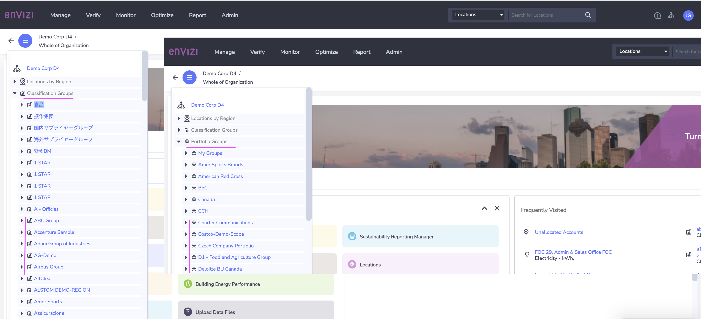
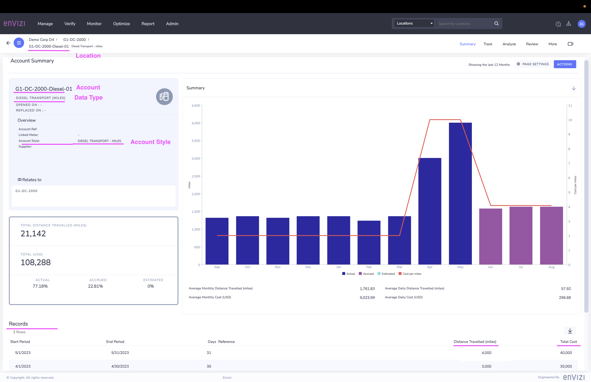
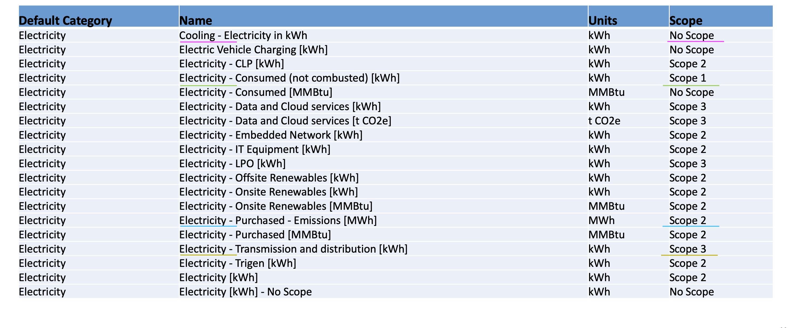
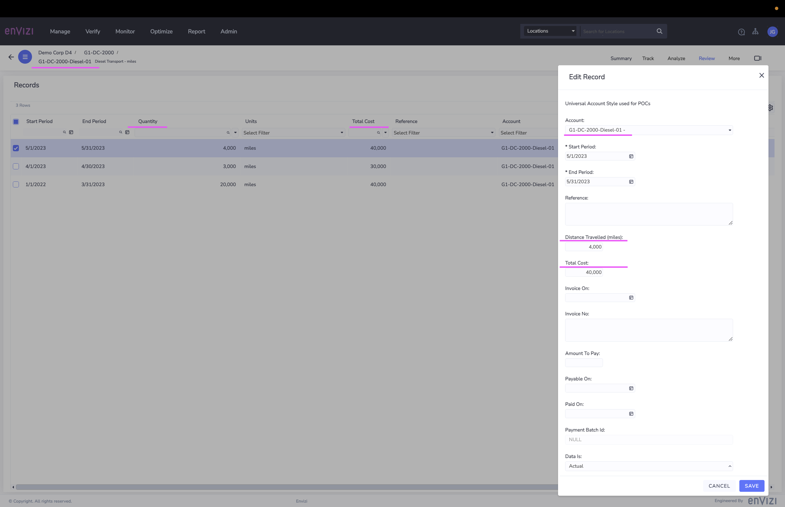
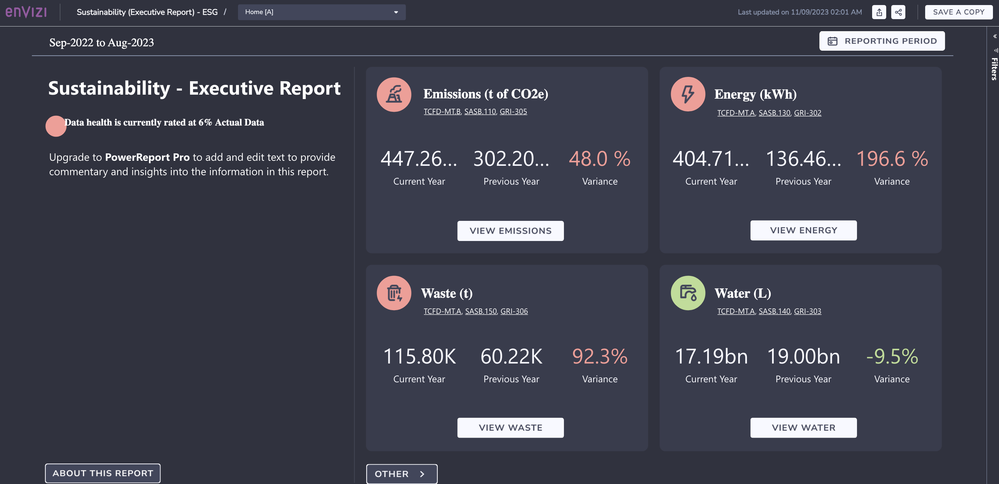

# Envizi Learning Journey

The objective of this article is to help understand the IBM Envizi ESG suite platform. This will be the first step in the learning journey of Envizi. 

## 1 What is Envizi 

IBM Envizi ESG suite offers comprehensive data and analytics software to collect, manage and derive insights from sustainability data.

### 1.1 Three pillars 

There are 3 pillars to how Envizi can help with the key challenges that are faced by many organizations with their sustainability journey.

#### Data Foundation
Build data foundation by helping clients to build a single system of that delivers auditable, financial grade sustainability data.
Clients can automatically capture any data required for reporting and consolidate different ESG data across the organization into a single system. 

#### Reporting and Disclosure
Reporting to internal and external stakeholders and dealing with multiple frameworks can be challenging. Envizi provides a suite of reporting tools, such as dashboards and reporting templates that help users to streamline reporting and disclosure. 

#### Accelerate Decarbonization
By using the insights provided on the platform, users are empowered to make informed data-driven decisions to unlocking pathways to decarbonization goals.

### 1.2 Modules

Envizi is a modular platform. The product framework consists of 9 modules with 3 solution pillars, underpinned by the data management layer. The modular and scalable functionality ensures clients current needs are met now and can scale up as needed. 

## 2 Data Management

The organization's operations are distributed across different locations, regions, business units, departments, manufacturing sites, suppliers, subsidiaries, and more. Organization needs to gather data from all these operations and guarantee the access to these data at any given moment.

### 2.1 Org Hierarchy

Envizi facilitates the organization of data through a hierarchical structure, enabling the creation of groups, subgroups, locations, accounts, meters, records, and more.

Here is the organization hierarchy with by Regions.

Here is the organization hierarchy by Classification Groups.

Here is the organization hierarchy by Portfolio Groups.

### 2.2 Groups

Groups are a collection of locations used for reporting or data access.

Groups are two types. The previous 2 images shows both the groups.
- Classification group
- Portfolio group

**Classification :** Classification type represent the foundation structure of the Organization. Each location must report 100% through the Classification hierarchy in order to be 100% included in enterprise reporting. If a location is not part of a group then it will be excluded from most dashboards and reports.

**Portfolio :** Portfolio type groups to reflect secondary reporting structures. 
A portfolio group may include some or all locations of varying report percentage allocations.

Subgroups are created under a group. 

### 2.3 Locations

Locations are used to describe buildings, properties, assets or sites within an Organization. An Organization can have multiple locations. Locations can also represent a virtual collection of account data.

In the below screeshots shows that the Account is assoicated with a Location.

### 2.4 Accounts

Accounts are used capture, store and report data from the various resources of an organization such as electricity, water, transport and etc.

It is configured at a location level. 
Account is associated with specific specific `data type` and `account style`.

The image shows the Data Type as `DIESEL TRANSPORT (MILES)` and Account style as `DIESEL TRANSPORT - MILES`

### 2.5 Records

Records represents the actual data from the resources. Ex: The electricity consumption of a particular account for the month.

The above image show the records associated with the account.

### 2.6 Categories

A Category in Envizi is grouping of data types.

Your organization is setup by default with a set of categories that are useful for tracking and analyzing your data at an aggregated level.

The below picture shows that there is a Category called `Electricity` that groups all the eletricity related data types here.

### 2.7 Data Type

Data types in Envizi describe a single measure or activity. 

The example data types are Electricity, Diesel, Natural Gas, Refrigerant R12, Water, Employees, Rail Shipping, Scope 3 emissions, Business Travel, Rental Car, Hotel Stays.

Data type contains the primary unit of measure `cost` and `consumption`.

Data type is assigned with some emissions scope (1/2/3/None). You can see in the above picture that each data type is assoicated with an scope.
 
### 2.8  Account Styles

Account Styles referes to the Data schema configured on top of a Data Type.

Account Styles are configured per customer to provide flexibility to meet different data capture requirements.

Account style defines the data fields (primary and secondary fields) to be captured 

Already 600+ account styles are available for the data type Electricity [kWh]

Here the primary field is `Distance Travelled (qty)` and secondary fields are `Cost` and etc.

## 3 Data capture 

In Envizi, you can create Group, Subgroup, Location, Accounts, Record and etc via several ways.

### 3.1 Create Data via UI

You can create data via Envizi User Interface.

Refer the documentations
https://community.ibm.com/community/user/envirintel/blogs/jeya-gandhi-rajan-m1/2023/04/04/create-orghierarchy-and-load-data-in-envizi-via-ui

https://knowledgebase.envizi.com/home/manually-capturing-data-records

### 3.2 Create Data via Universal Date Collector

You can create data via Universal Date Collector template available in excel.

Refer the documentation

https://knowledgebase.envizi.com/home/universal-account-setup-and-data-loading-process

https://knowledgebase.envizi.com/home/data-flow-automation

## 4 Reports

There are 4 types of reports available in Envizi.
- Dashboards
- Power Reports – PowerBI Standard Content
- Extract Reports
- Envizi API
	
## 4.1 Dashboards

Dashboards are interactive pages that allow the reporting and display of data in a visual format.

Dashboards are available at all levels generally where there is a Summary page:
- Organizational 
- Group 
- Location
- Account
- Meter

Several controls are available in Dashboard.
- **Compare With:** Defines the compare period that the Current period is selected for:
- **View As: Specifies the Unit of measure for the data in the dashboard. 
- **Time slider: Dictates the Current period chosen to display. The time slider can be dragged left or right to cover the appropriate period. 
- **Filter:** The filter funnel activates the filtering options available: Groups, Measures, Regions, Locations.
- **Actions:** Activates the Email dashboard or Schedule a Dashboard options

### 4.2 Power Reports

Envizi PowerReport is supercharged by Microsoft PowerBI, the world’s leading reporting and analytics platform. Envizi content powered by PowerReport provides a range of visual dashboards to support reporting.

In the base model the following standard and configurable reports are available.

#### Standard Content
- Sustainability (Executive Report)
- Sustainability (Portfolio Performance)
- Account Data Health Check 

#### Configurable Content
- Market-based Emissions
- CDP Climate Report
- Scope 3 Emissions

### 4.3 Extracting reports

IBM Envizi reports allow users to specify a range of selection criteria to view the data in screen and download and to send the report in mail.

- Choose from various delivery methods (screen, email)
- Choose Groups, locations, Regions, Utilities, report time period/end date
- Choosing `Create Report and E-mail it now` in CSV, PDF, XLSX format
- Choosing `Schedule Report and E-mail it later` also adds the Daily, Weekly, ...etc. schedule.

Click Submit to run the report based on the selected parameters.

### 4.4 API

The Envizi API promotes sharing of data from the Envizi platform and allows users to access and retrieve data from Envizi directly through to compatible third-party software, such as Microsoft Excel, Tableau or Power BI, without the need to log in to Envizi's main user interface. 

- Envizi API is an add-on feature in freeing up the data within Envizi
- Saves time and streamlines reporting and data analytics needs
- Extract multiple data sets at once
- Reports maintain data connectivity & can be refreshed by a user at anytime
- Combine these data sets to create a single reporting output 
- Envizi can integrate with your organization’s 3rd party reporting tools

Refer the documentation.

Use APIs to expose Envizi data to external systems
https://developer.ibm.com/articles/use-apis-to-expose-envizi-data-for-external-systems/

https://knowledgebase.envizi.com/home/envizi-api-overview
 

## 5 Disclosures

During the ESG reporting season, sustainability manager manages multiple ESG disclosure projects concurrently. The volume of data that needs to be complied and reviewed from multiple teams and stakeholders across the business is immense. And the stakes are high: reports need to be financial grade, need to be fully auditable, and the VP of Sustainability needs to sign off before disclosures are published.

In Envizi, Sustainability manager can efficiently organize the people, processes, responses and supporting data required to respond to ESG disclosures. 

Through pre-configured templates and reports, as well as the ability to create custom disclosures, Envizi supports streamlining disclosures to a number of different frameworks.

### 5.1 Sustainability Reporting Manager (SRM)

The Envizi Sustainability Reporting Manager is a tool that pulls together Envizi's quantitative data, attachments, web links, and response methodologies to facilitate the management of ESG data and the formulation of final responses.

The SRM offers up-to-date guidance on best practices to facilitate the completion of responses as mandated by ESG frameworks.

The SRM tool encompasses a wide range of ESG Frameworks, including `TCFD, SASB, GRI, SFDR, UN SDGs, INREV, EPRA, SEC Climate Proposal, EU Taxonomy, PRI, and BRSR`.

### 5.2 GRESB and CDP

Though Envizi supports most widely used frameworks comprehensively, there may be certain frameworks that are not included. In such instances, Envizi has developed alternative tools and reports to meet the requirements of specific frameworks, as is the case with `GRESB` and `CDP` at present.
 

## 6 De-Carbonization

### 7.1 Target setting and Tracking

## 8 Others
### 8.1 Audit trail

### 8.2 Modules

